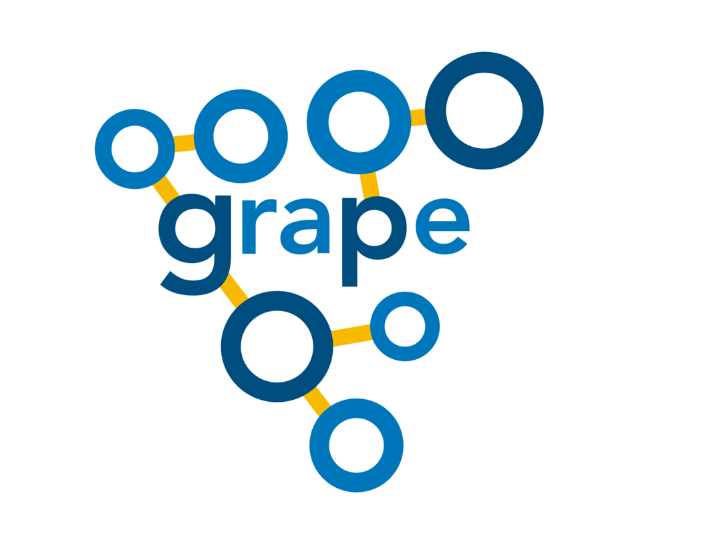

<p align="center">
  <a href="http://github.com/mathLab/GRAPE" target="_blank" >
    
  </a>
</p>
<p align="center">
    <a href="https://github.com/mathLab/GRAPE/blob/master/LICENSE" target="_blank">
        
    </a>
    <a href="https://travis-ci.org/mathLab/GRAPE" target="_blank">
        
    </a>
    <a href='https://coveralls.io/github/mathLab/GRAPE'>
        
    </a>
    <a href="https://www.codacy.com/app/mathLab/GRAPE?utm_source=github.com&amp;utm_medium=referral&amp;utm_content=mathLab/GRAPE&amp;utm_campaign=Badge_Grade">
        
    </a>
</p>

**GRAPE**: GRAph Parallel Environment

## Table of contents

* [Description](#description)
* [Dependencies and installation](#dependencies-and-installation)
* [Documentation](#documentation)
* [Testing](#testing)
* [Authors and contributors](#authors-and-contributors)
* [How to contribute](#how-to-contribute)
  * [Submitting a patch](#submitting-a-patch) 
* [License](#license)

## Description

**GRAPE** (GRAph Parallel Environment) is a Python package that takes advantage of **Graph Theory** into a *High Performance Computing* (HPC) environment to develope a screening tool aimed at studying the effect of different kinds of perturbations in interconnected systems, such as industrial plants.

The tool allows to represent the dependencies between components and predict the state of health and the residual functionality of degradable systems after a casualty, suggesting the proper reconfiguration strategies to mitigate the damage. The results obtained from the graph analysis can be therefore used to improve topology, robustness, and resilience profile of industrial facilities against domino effect propagation.

In particular, the components contribution to the cascade effects resulting from adverse events can be evaluated through centrality and efficiency measures, highlighting the plants major criticalities, vulnerabilities and potential weak points.

Considering that the most computationally expensive parts of the program involve the calculation of shortest paths, parallelization of shortest path computation in large unweighted graphs was integrated in the program. This was done taking advantage of the Python modules multiprocessing and threading. Two different sequential algorithms for the solution of the shortest path problem have been parallelized including a Single Source Shortest Path (SSSP) algorythm for sparse graphs and an All Pairs Shortest Path one (APSP) for dense graphs.

## Dependencies and installation

**GRAPE** requires `numpy`, `scipy`, `matplotlib`, `networkx`, `nose` (for local test) and `sphinx` (to generate the documentation). The code is compatible with Python 2.7.

### Installing from source

The official distribution is on GitHub, and you can clone the repository using

```bash
> git clone https://github.com/mathLab/GRAPE
```

To install the package just type:

```bash
> python setup.py install
```

To uninstall the package you have to rerun the installation and record the installed files in order to remove them:

```bash
> python setup.py install --record installed_files.txt
> cat installed_files.txt | xargs rm -rf
```

## Documentation

**GRAPE** uses [Sphinx](http://www.sphinx-doc.org/en/stable/) for code documentation. To build the html versions of the docs simply:

```bash
> cd docs
> make html
```

The generated html can be found in `docs/build/html`. Open up the `index.html` you find there to browse.

## Testing

We are using Travis CI for continuous intergration testing. You can check out the current status [here](https://travis-ci.org/mathLab/EZyRB).

To run tests locally:

```bash
> python test.py
```


## Authors and contributors

**GRAPE** is currently developed and mantained at [SISSA mathLab](http://mathlab.sissa.it/) by

- [Aurora Maurizio](mailto:auroramaurizio1@gmail.com)
- [Nicola Demo](mailto:demo.nicola@gmail.com)

under the supervision of [Prof. Gianluigi Rozza](mailto:gianluigi.rozza@sissa.it). 

Contact us by email for further information or questions about **GRAPE**, or
suggest pull requests. **GRAPE** is at an early development stage, so
contributions improving either the code or the documentation are welcome!

## How to contribute

We'd love to accept your patches and contributions to this project. There are
just a few small guidelines you need to follow.

### Submitting a patch

1. It's generally best to start by opening a new issue describing the bug or
   feature you're intending to fix.  Even if you think it's relatively minor,
it's helpful to know what people are working on.  Mention in the initial issue
that you are planning to work on that bug or feature so that it can be assigned
to you.

2. Follow the normal process of [forking][] the project, and setup a new
   branch to work in.  It's important that each group of changes be done in
   separate branches in order to ensure that a pull request only includes the
   commits related to that bug or feature.

3. To ensure properly formatted code, please make sure to use 4
   spaces to indent the code. The easy way is to run on your bash the provided
   script: ./code_formatter.sh. You should also run [pylint][] over your code.
   It's not strictly necessary that your code be completely "lint-free",
   but this will help you find common style issues.

4. Any significant changes should almost always be accompanied by tests.  The
   project already has good test coverage, so look at some of the existing
   tests if you're unsure how to go about it. We're using [coveralls][] that
   is an invaluable tools for seeing which parts of your code aren't being
   exercised by your tests.

5. Do your best to have [well-formed commit messages][] for each change.
   This provides consistency throughout the project, and ensures that commit
   messages are able to be formatted properly by various git tools.

6. Finally, push the commits to your fork and submit a [pull request][]. Please,
   remember to rebase properly in order to maintain a clean, linear git history.

[forking]: https://help.github.com/articles/fork-a-repo
[pylint]: https://www.pylint.org/
[coveralls]: https://coveralls.io
[well-formed commit messages]: http://tbaggery.com/2008/04/19/a-note-about-git-commit-messages.html
[pull request]: https://help.github.com/articles/creating-a-pull-request

## License

See the [LICENSE](LICENSE.rst) file for license rights and limitations (MIT).
