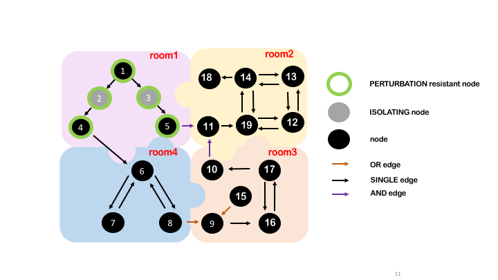

# Input description

The input for the graph construction currently 
consists of text files reflecting the hierarchy of
the plant components and their features.
In the text input files each line corresponds 
to a node/component description. 
The same line reports the name of the predecessor 
of a particular node/component, 
the relationship between them, and the list of 
node’s attributes (room in which the component is 
present, perturbation resistance, etc.).
In this way each line corresponds to an edge
connecting a component to its parent component.

Each line should contain the following info:
- component id (**Mark**)
- parent of the component id (**father_mark**)
- parent-child relationship 
(**father_cond**: *AND*, *OR*, *SINGLE*, *ORPHAN*. It is an edge attribute.)
- type of component 
(**Description**: *isolation_A*, *isolation_B* are isolating components 
with opposite behaviour. It is a node attribute.)
- state of the isolating component 
(**InitStatus**: *1*, *0*. It is a node attribute.)
- room in which the component is located 
(**Area**. It is a node attribute.)
- component external perturbation resistance 
(**PerturbationResistant**: *1*, *0*. It is a node attribute.)
- source - target components 
(**From_to**: *SOURCE* or *TARGET*. It is a node attribute.)

The hierarchy of the components explains how commodities
flow from one component to another component
and from one system to another system. 
In fact, if the input is properly formatted, with this
simple digraph model it is possible to represent and 
integrate different interconnected plants
in a unique graph without losing information about 
their peculiarities. 

In the graph, the nodes represent the system components 
while the edges connecting the nodes harbor the logic 
relations (edge attributes) existing between the components 
(*ORPHAN*, *SINGLE*, *AND*, and *OR*).
- An **ORPHAN** edge is the edge of a node without predecessors.
- A **SINGLE** edge connects a node to its only one predecessor.
- An **AND** edge indicates that the node/component 
has more than one predecessor. All the predecessors are 
necessary for the functioning of that component.
- An **OR** edge indicates that the node/component has 
more than one predecessor. Just one of the node’s 
predecessors should be active to guarantee the functioning 
of the component.
For this reason, correct input formatting 
is one of the most important steps of the analysis.

## Example

In the cartoon is represented the example input file  `TOY_graph.csv `.
In this file are present 19 nodes/components connected by
direct edges that reflect the hierarchy of the system 
in a parent-child fashion.

The nodes are disributed in adjacent rooms.

In room1 are present 5 nodes: 1, 2, 3, 4 and 5.

In room2 are present nodes: 11, 19, 12, 13, 14 and 18.

In room3 are present nodes: 15, 9, 16, 17 and 10.

In room4 are present nodes: 6, 7 and 8.

A damage of one or multiple components in one room
may exceed the room boundaries and propagate
to other systems connected to it, located in other
rooms. 

Nodes 1, 2, 3, 4, 5 are perturbation resistant nodes 
("PerturbationResistant" field = "1").
These nodes will not be affected by the simulated
perturbation.

Nodes 2 and 3 are isolating components ("Description field" =
"isolation_A"). In the figure, damaging node 1 would result 
in the breakage of all the nodes present in the graph except 
node 15 in absence of isolating components. On the other hand, 
isolating components 2 and 3 would stop the damage propagation
cascade to node 1.

## Simulate a damage to component '1' 

1. In file `general_graph.py`:

* Uncomment `g.delete_a_node("1")`.

* Uncomment `g.check_input_with_gephi()`.

2. Run:

 `python general_graph.py TOY_graph.csv `

# Output description:

### component_damage.csv

In this table is listed the new status of the components 
(active, not-active) and the rooms in which the components 
are located (affected, not affected) as well as the new status
of components that have been operated to stop the 
propagation of the damage or to open new paths
in case of unavailabilty of the default ones. 
The efficiency (*nodal efficiency*, *local efficiency*, *global efficiency*)
and closeness indices (*closeness_centrality*, *betweenness_centrality*, 
*indegree_centrality*) are then recalculated.

### service_paths_component_damage.csv

In this table are reported the paths (all paths and shortest paths), if any, 
that connect source and target components.
Paths are calculated before and after damaging one or multiple components.

### general_code_output.log

Logging debug output.

### check_import_nodes.csv

List of nodes to visualize the input with Gephi.

### check_import_edges.csv

List of edges to visualize the input with Gephi.

